# 🧑‍⚕️ Hippocrate - Coworking Space Website

Hippocrate is a modern and responsive website designed for a coworking space.The project includes both user-facing pages and an admin panel for managing room reservations efficiently.

## 🌐 Features

- 🏠 **Landing Page** – Clean, informative introduction to the coworking space.
- 📋 **Services Page** – List of amenities and offerings.
- 📋 **Reservation Page**
- 📞 **Contact Page** – Easy-to-use form to reach out.
- 🔐 **Admin Dashboard** – Manage reservations and room availability.

## 🛠️ Tech Stack

- **Frontend:** React, Tailwind CSS, Vite
- **Backend:** Node.js, Express 
- **Database:** MongoDB


## 📸 Screenshots

### Home Page

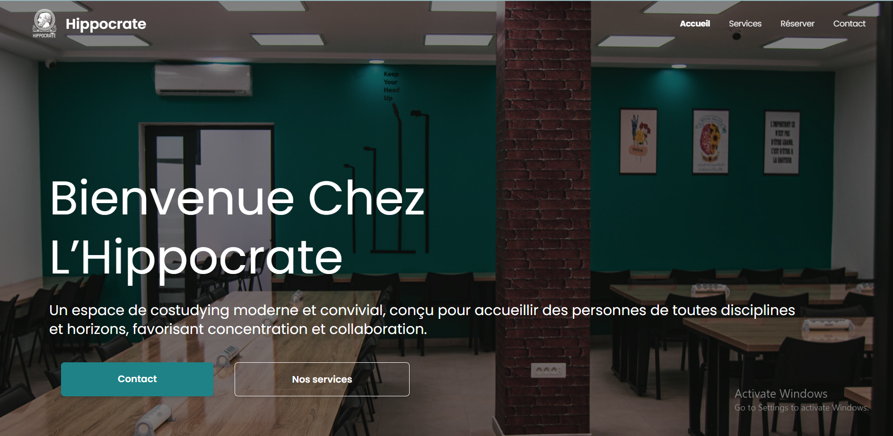
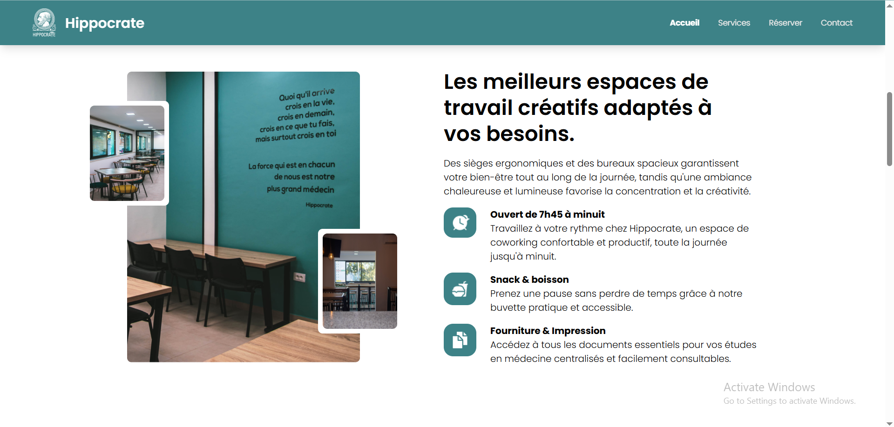
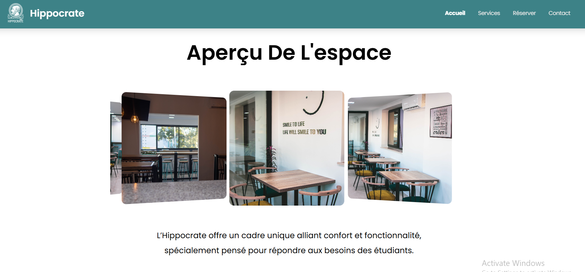
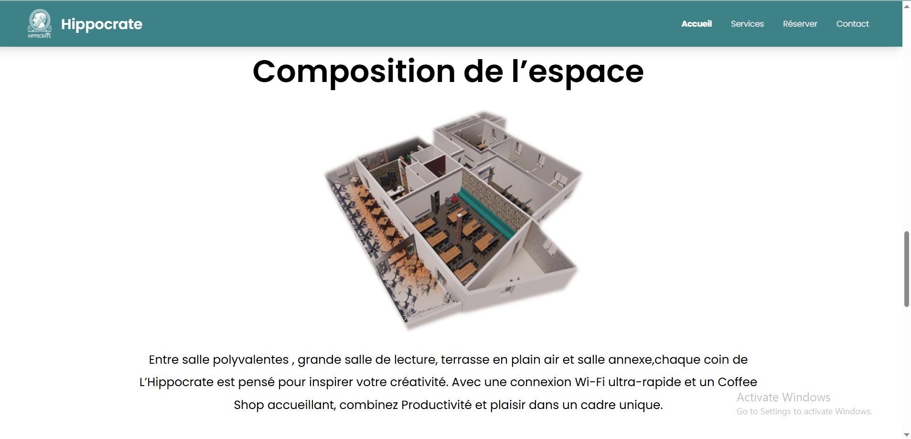


### Services Page

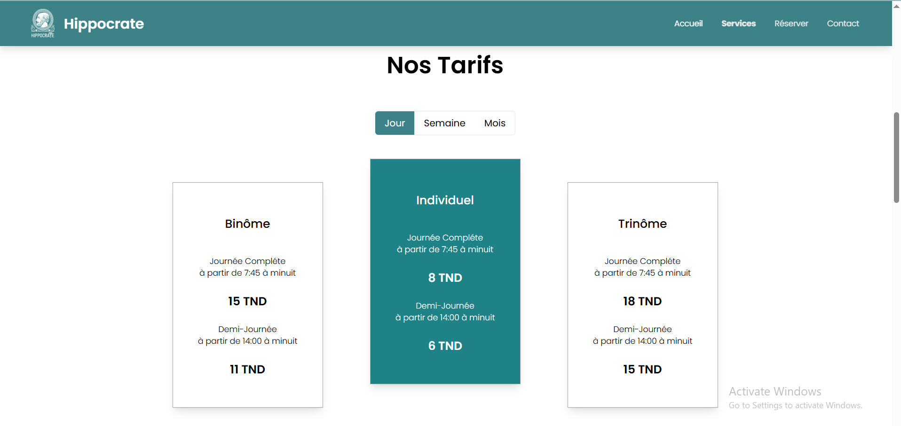
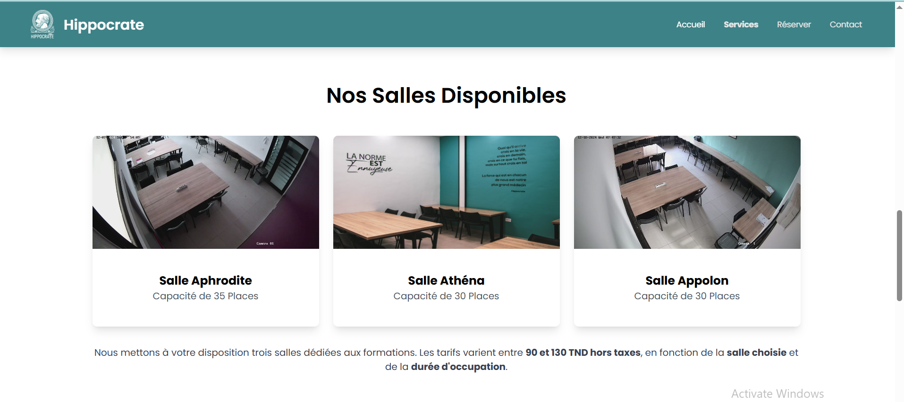

### Reservation Page 

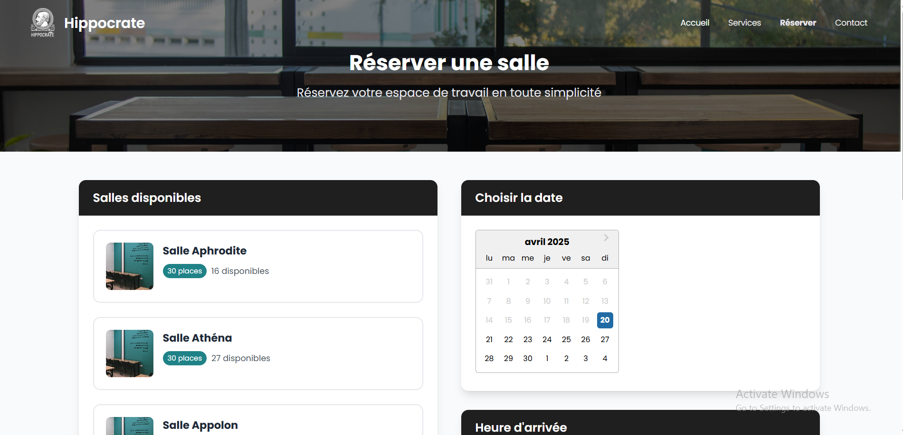
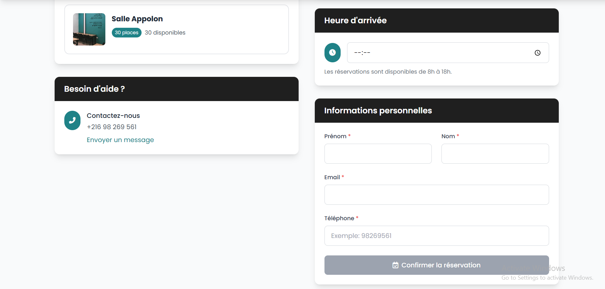

### Contact Page 
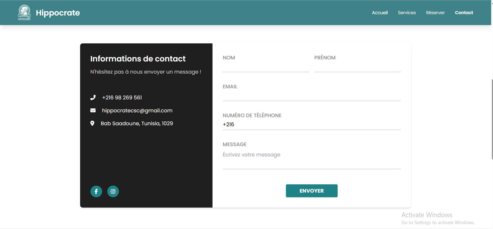
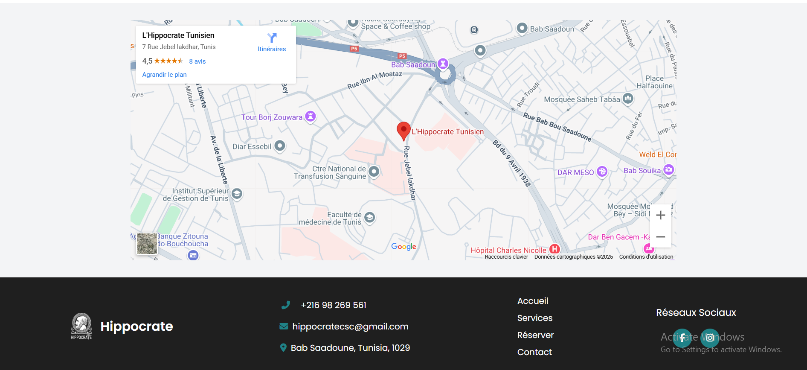


### Admin Panel - Reservations

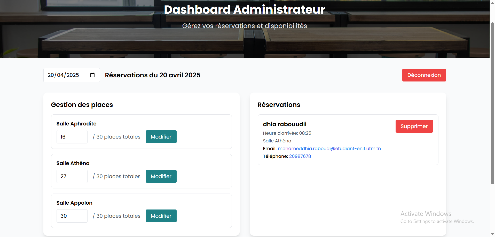


## 🚀 Getting Started

```bash
# Clone the repo
git clone https://github.com/raboudidhia/Hippocrate-vitrine.git
cd hippocrate-vitrine

# Install dependencies
npm install

# Run the development server
npm run dev
Running Tests


Backend: cd backend && npm test


Frontend: cd client && npm test

CI/CD Pipeline

Automated builds, tests, and deployment via Jenkins.

Deployed to a local Kubernetes cluster using KIND.